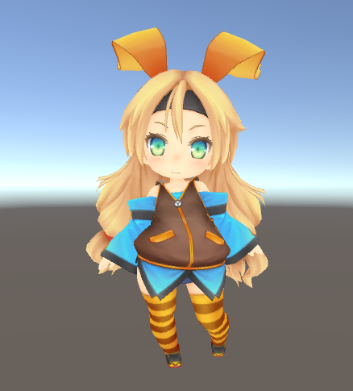
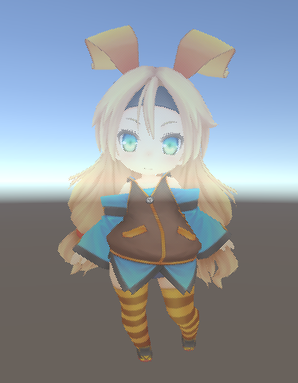

# Unity-NetlikePenetrate
A shader of netlike penetrate effect. To use for obstruction. In DQB game effect.

# Feature
When there are block can make the object according to the pixel hidden so that have transparent effect.

*Before
  

*After

